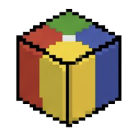
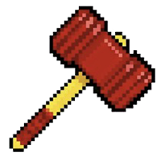
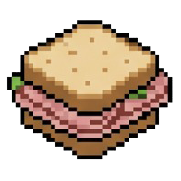
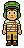
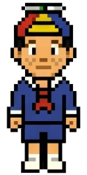
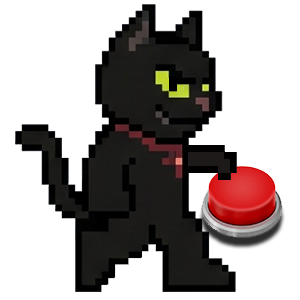
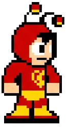

<p align="center">
  
</p>

<h1 align="center" style="margin-top: 10px; margin-bottom: 20px;">🥪 Missão pelo Sanduíche</h1>

<h2 align="center" style="margin-top: 10px; margin-bottom: 20px;">Projeto de Introdução à Programação</h2>

<h4 align="center" style="margin-top: 10px; margin-bottom: 20px;">
Relatório de desenvolvimento do jogo Missão pelo Sanduíche, desenvolvido para a disciplina de Introdução à Programação pelos alunos do Centro de Informática (CIn) - UFPE período letivo 2026.1 Equipe 02.</h4>


## Índice
* [1. Como Instalar e Rodar o Jogo](#como-instalar)
* [2. Itens e Coletáveis do Jogo](#itens-recursos)
* [3. Personagens Presentes no Jogo](#personagens)
* [4. Sobre o Jogo](#sobre-o-jogo)
* [5. Estrutura / Arquitetura do Projeto](#estrutura-projeto)
* [6. Tecnologias](#tecnologias-utilizadas)
* [7. Equipe](#equipe-desenvolvimento)

---

<a id="como-instalar"></a>
## Instalar e Rodar o Jogo

### Importe o projeto e execute os seguintes comandos no terminal, dentro da pasta do projeto:

#### 1º&nbsp;:&nbsp;&nbsp;Verifique se já existe uma pasta de virtual environment. Ela pode aparecer como ".venv", "venv", ou semelhantes. Caso não haja, crie uma virtual environment chamada 'venv':

```shell
python3 -m venv venv
```

#### 2º&nbsp;:&nbsp;&nbsp;Entre no ambiente virtual criado ou já existente para ser usado pelo projeto: Substitua "&lt;nome&gt;" pelo nome do virtual environment.

#### Comando caso esteja usando Sistemas Linux:
```shell
source <nome>/bin/activate
```

#### Comando caso esteja usando sistema Windows:
```shell
.\<nome>\Scripts\Activate.ps1
```

#### 3º&nbsp;:&nbsp;&nbsp;Instale o pygame com o comando:

```shell
pip install pygame
```

#### 4º&nbsp;:&nbsp;&nbsp;Inicie o jogo executando esse comando no terminal da raiz principal do projeto:

```shell
python3 -m main
```

---

<a id="itens-recursos"></a>
## Itens e Coletáveis do Jogo

| Item / Coletável | Sprite | Descrição e Utilidade |
| :---: | :---: | :--- |
| Bola Quadrada |  | Item perdido pelo Quico. Chaves precisa recuperá-la dentro da Casa da Bruxa do 71, desviando do Gato Satanás, para dar início à negociação pelo sanduíche. |
| Marreta Biônica |  | Pertence ao Chapolin Colorado e está caída perto do Tanque de Lavar Roupas. Ao ser usada, invoca o Chapolin em um desfecho épico. |
| Sanduíche de Presunto |  | O objetivo final da missão. Cai da janela da Dona Florinda após o Chapolin bater na parede. Coletar este item encerra o jogo com a tela de vitória. |

---

<a id="personagens"></a>
## Personagens Presentes no Jogo

| Personagem | Sprite | Descrição |
| :---: | :---: | :--- |
| Chaves |  | Personagem principal e jogável. Está com fome e precisa encontrar um sanduíche de presunto a todo custo. |
| Quico |  | NPC que permite a passagem pela escada em troca da bola quadrada. |
| Gato Satanás |  | | Inimigo que patrulha o interior da Casa da Bruxa. Pisar em uma posição errada na casa da bruxa explode o Chaves. |
| Chapolin Colorado |  | NPC que permite que o Chaves obtenha o sanduíche em troca da Marreta Biônica. |

---

<a id="sobre-o-jogo"></a>
## Sobre o Jogo

**Missão pelo Sanduíche** é um RPG 2D top-down feito em Python com Pygame, inspirado no universo do seriado Chaves.

### História

O Chaves acorda com fome no Pátio do Barril e topa qualquer coisa por um sanduíche de presunto. O Quico faz uma proposta: ele consegue o sanduíche se o Chaves achar a Bola Quadrada. A busca leva o Chaves pelo Pátio da Fonte, para dentro da assustadora Casa da Bruxa do 71 e de volta ao ponto de partida, num desfecho épico que só o Chapolin Colorado poderia protagonizar.

### Mecânicas de Jogo

- Movimentação por blocos via teclas W, A, S, D.
- Colisão com paredes, móveis e limites de mapa.
- Coleta de itens.
- Diálogos com NPCs acionados por proximidade.
- Gato Satanás com sistema de explosão.

### Controles

| Tecla | Ação |
| :---: | :--- |
| ↑ | Mover para cima |
| ← | Mover para esquerda |
| ↓ | Mover para baixo |
| → | Mover para direita |

---

<a id="estrutura-projeto"></a>
## Estrutura / Arquitetura do Projeto

```text
Projeto-de-IP
├── classes
│   ├── gif_overlay.py
│   ├── items.py
│   ├── jogo.py
│   ├── mapa.py
│   ├── npc.py
│   ├── personagem.py
│   └── utils.py
├── data
│   ├── balao_de_fala
│   │   ├── chapolin.png
│   │   └── quico.png
│   ├── cenarios
│   │   ├── cenario0.png
│   │   ├── cenario1.png
│   │   ├── cenario2.png
│   │   └── overlays
│   │       ├── cenario0_overlay.png
│   │       ├── cenario1_overlay.png
│   │       ├── cenario2_overlay.png
│   │       └── final.png
│   ├── chapolim
│   │   ├── chapolim.png
│   │   └── chapolim_outline.png
│   ├── chaves
│   │   ├── chaves_baixo_1.png
│   │   ├── chaves_baixo_2.png
│   │   ├── chaves_baixo_3.png
│   │   ├── chaves_baixo_4.png
│   │   ├── chaves_cima_1.png
│   │   ├── chaves_cima_2.png
│   │   ├── chaves_cima_3.png
│   │   ├── chaves_cima_4.png
│   │   ├── chaves_cima_parado.png
│   │   ├── chaves_direita_1.png
│   │   ├── chaves_direita_2.png
│   │   ├── chaves_direita_3.png
│   │   ├── chaves_direita_4.png
│   │   ├── chaves_direita_parado.png
│   │   └── chaves_parado.png
│   ├── coletaveis
│   │   ├── bola.png
│   │   ├── bola_item.png
│   │   ├── marreta.png
│   │   ├── marreta_item.png
│   │   ├── sanduiche.png
│   │   └── sanduiche_item.png
│   ├── gato
│   │   ├── exp0.png ... exp19.png   (20 frames de expressão)
│   │   ├── gatofdp1.png
│   │   └── gatofdp2.png
│   ├── madruga
│   │   └── 1.png
│   └── quico
│       ├── quico.png
│       └── quico_outline.png
├── .gitignore
├── .mailmap
├── main.py
└── README.md
```

<p align="center">
  
</p>

---

<a id="tecnologias-utilizadas"></a>
<h1 align="center">Ferramentas/Tecnologias</h1>

<p align="center">
  
</p>

<p align="center">
  &nbsp;&nbsp;&nbsp;&nbsp;
  &nbsp;&nbsp;&nbsp;&nbsp;
  &nbsp;&nbsp;&nbsp;&nbsp;
  &nbsp;&nbsp;&nbsp;&nbsp;
  &nbsp;&nbsp;&nbsp;&nbsp;
  &nbsp;&nbsp;&nbsp;&nbsp;
  
  
</p>

---

<a id="equipe-desenvolvimento"></a>
<h2 align="center">👥 Equipe</h2>

<div align="center">
  <table>
    <tr>
      <td valign="middle" align="center">
        <a href="https://github.com/vitor-java">
          <br>Vitor
        </a>
      </td>
      <td valign="middle" align="center">
        <a href="https://github.com/eugeni1">
          <br>Eugênio
        </a>
      </td>
      <td valign="middle" align="center">
        <a href="https://github.com/Arthur-Carvalh01">
          <br>José
        </a>
      </td>
      <td valign="middle" align="center">
        <a href="https://github.com/Guilhermerlemos">
          <br>Guilherme
        </a>
      </td>
      <td valign="middle" align="center">
        <a href="https://github.com/Rafael040305">
          <br>Cagnin
        </a>
      </td>
      <td valign="middle" align="center">
        <a href="https://github.com/PedroReis0310">
          <br>Pedro
        </a>
      </td>
    </tr>
  </table>
</div>

<p align="center">
  
</p>
